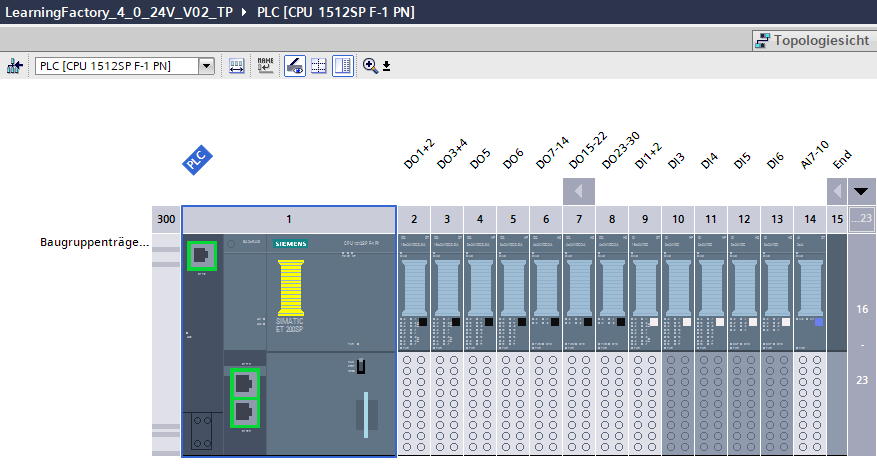
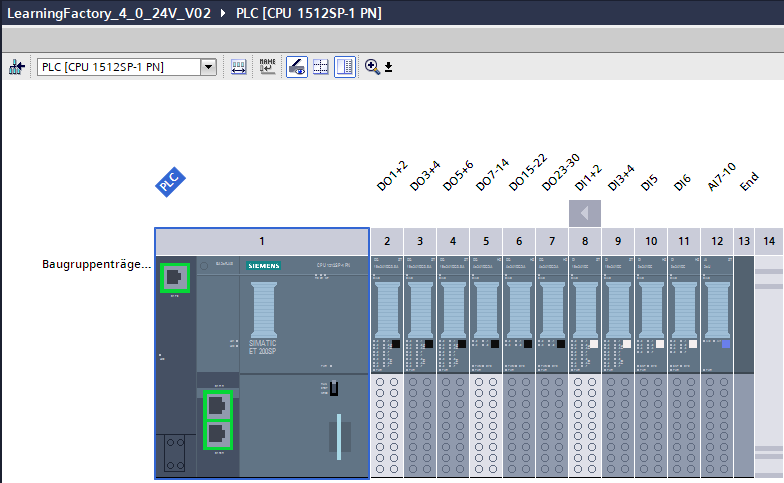
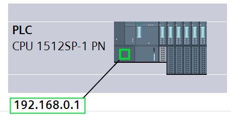

# Source code as SCL / ST

If a different PLC as S7 1500 is used, other software tools have to be used to create and load the programs and to start up the Training Factory Industry 4.0 model.

Depending on the PLC, the source code in this folder can be imported for creating the PLC programs.

see [Structured Text (ST)](https://en.wikipedia.org/wiki/Structured_text)

## TP

## IM

