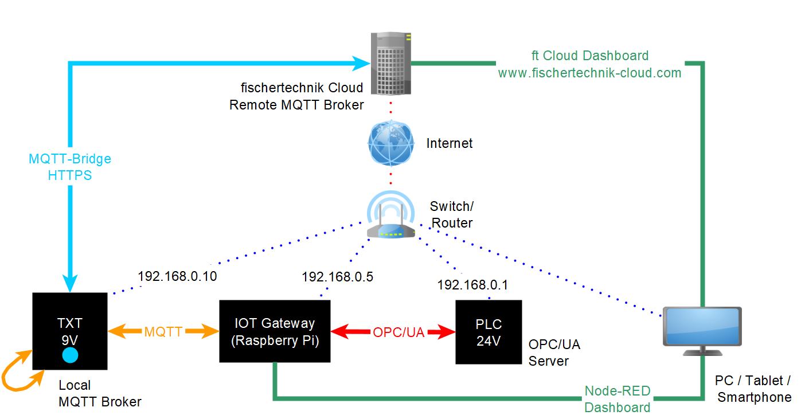

> If you have any questions, please contact fischertechnik-technik@fischer.de

# fischertechnik Training Factory Industry 4.0 24V (en)
This project contains the PLC programs, the IOT gateway SD card image with [Node-RED](https://nodered.org/) flows and the TXT gateway C program for the fischertechnik [**Training Factory Industry 4.0 24V**](https://www.fischertechnik.de/en/products/simulating/training-models/554868-sim-training-factory-industry-4-0-24v-simulation).

| Folder | Content |
| --- | --- |
| [Node-RED](Node-RED/README.md)                             | Node-RED flows, SD card image for IOT gateway        |
| [PLC_S7_1500](PLC_S7_1500/README.md)                       | PLC S7 1500 project (TIA Portal v16)                 |
| [PLC_S7_1500_exercises](PLC_S7_1500_exercises/README.md)   | PLC S7 1500 exercises (TIA Portal v16)               |
| [PLC_SCL_sources](PLC_SCL_sources/README.md)               | PLC sources as SCL (Structured Control Language)     |
| [TxtGatewayPLC](TxtGatewayPLC/README.md)                   | C program TxtGatewayPLC.cloud for the TXT controller |

## Hints
* In the PLC examples PWM must be activated on the adapter boards. Please check the jumpers and activate all PWMs if they are disabled!
* TIA16 is needed to open the example files. Please see [hints for TIA15](hints_TIA15_TIA16.md) 

## Controllers
The standard demo scenario is implemented with the [www.fischertechnik-cloud.com](https://www.fischertechnik-cloud.com). It is also possible to use the PLC program without the fischertechnik cloud. In this case the local Node-RED dashboard can be used.

The following diagram shows the communication between the 3 controllers PLC, TXT controller and IOT gateway (Raspberry Pi 4):

## Network
The next picture shows the network overview with the controllers.

The factory consists of the following stations:
* **SSC**: Sensor Station with Camera
* **HBW**: High-Bay Warehouse
* **VGR**: Vacuum Gripper Robot
* **DPS**: Delivery and Pickup Station
* **MPO**: Multi-Processing Station with Oven
* **SLD**: Sorting Line with Color Detection

## Node-RED
The [Node-RED](https://nodered.org/) flows for the Training Factory Industry 4.0 24V you can find in [Node-RED](Node-RED/README.md) folder. 

## OPC-UA Interface
You can use the [UaExpert](https://www.unified-automation.com/) tool to determine the OPC-UA interface of the Training Factory Industry 4.0 24V (see [screenshots](OPC-UA.md)).
