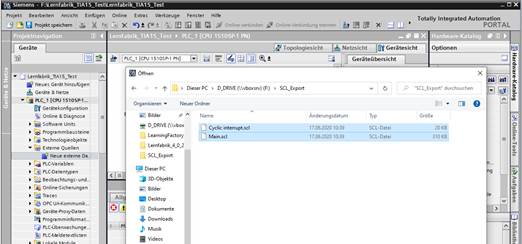
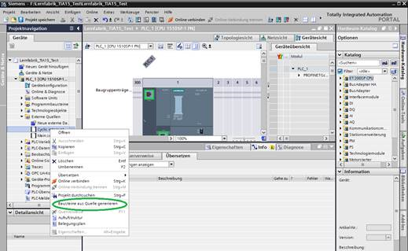
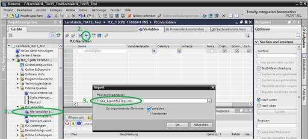

# Hints for Converting from TIA16 to TIA15

1. Create new empty TIA15 project

2. Add hardware to project

3. Activate the OPC-UA usage in the PLC (license!)

4. Connect the two SCL files under External data sources

5. Generate the Siemens program blocks with Generate blocks from source

6. The variables used in the SCL sources are still unknown and must be imported now. Via Show all variables (1.) the import of a variable table (2.) + (3.) can be executed.

