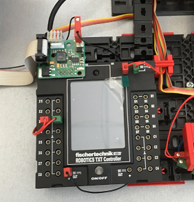

# HowTo Setup TXT Controller
This How-To describes the steps how to setup a new TXT controller of the fischertechnik model *Training Factory Industry 4.0 24V*.

> If you have any questions, please contact: fischertechnik-technik@fischer.de

## Preparation
You need a TXT controller with the current firmware version 4.6.6.

## 1. Update TXT Firmware
Update the TXT controller firmware **via ROBO Pro software**.
  - Install [ROBO Pro 4.6.6](https://github.com/fischertechnik/FT-TXT/releases/download/v4.6.6/ROBOPro466.msi)
  - Connect TXT controller with the computer via USB cable
  - Start ROBO Pro, click on "COM/USB" symbol and select TXT controller and USB interface and open the Test-Interface window. Be patient, the TXT firmware update takes about 5-10 minutes. **DO NOT interrupt the power supply, because otherwise the controller is defective and needs to be repaired. All the files on the TXT controller will be overwritten after this step.**

## 2. Replace TXT Controller
  - Remove connections (+9V, USB, EXT-adaptor, inputs and  +9V_out)
  - Remove old TXT controller
  - Install new TXT controller
  - Restore connections (see picture below)
  

## 3. TXT Settings
Change TXT settings:
  - **Role**: **Online**: Cloud-Client, **Offline**: MQTT Broker
  - **Security settings**: Enable WEB Server and SSH Daemon
  - **Network settings**: disable Bluetooth, activate WLAN Client, setup DHCP (see analogous to [network WLAN settings](https://github.com/fischertechnik/txt_training_factory/blob/master/doc/Network_Config.md)
  
## 4. Nano Router Settings
Update Client address reservation on Nano Router:
  - **Nano Router**: open 192.168.0.252 in WEB browser user:admin, password:admin, edit MAC in address reservation

## 5. Deploy C Programs
Use TXT [WEB server](https://github.com/fischertechnik/txt_training_factory/blob/master/doc/WEBServer.md) to copy the program from PC to the TXT controller
  - Online: Copy C program "TxtGatewayPLC.cloud" to the folder "**Cloud**"
  - Offline: Copy C program "TxtGatewayOfflinePLC" to the folder "**C-Program**"
Set *AutoLoad* for the program

## 6. Power Off and On
Switch off and on the TXT controller in the training model.

## 7. Start and Check
Start the factory.

# Hints
- The version of the TXT firmware can be found on the TXT controller in the menue `Settings -> info`
- The version of the ROBO Pro can be found in menue `Help -> About...`
